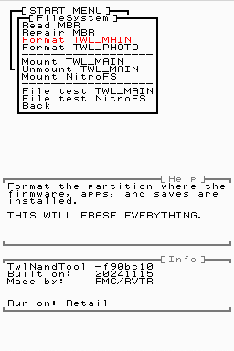
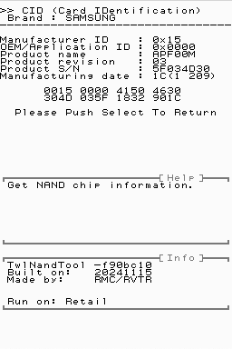

#  TwlNandTool

TwlNandTool is **the** best DSi NAND repair tool out there, offering features such as:
- Fixing MBR
- Formatting FAT partitions
- Recovering deleted HWInfo Secure
- Installing Stage2 (NandFirm)
- Installing new system files
- Installing minimal firmware titles and unlaunch
- Testing firmware and DSiWare for corruption
- Lots of useful NAND diagnostic info
- And more documented [here!](USAGE.md)

Why do these matter? No matter how badly messed up your DSi is- even if your NAND is zerofilled- TwlNandTool can put it back in a working state. You don't even need a NAND backup (though it is still **HIGHLY RECOMMENDED**)! Best of all, it's compatible with retail and development DSis both!



## Building
devkitPro decided to release libnds v2.0 and break... everything. Features I need like lower level NAND editing do not seem to work in the new calico, so I'm evily forcing you to use an offensive pre-v2.0 docker image that'll destroy the community or something. I think that's what devkitPro would say. Anyways:

Download the outdated docker image!
```sh
docker image pull devkitpro/devkitarm:20241104
```
Run the outdated docker image!
```sh
docker run --rm -v /home/rvtr/Desktop/TwlNandTool:/work \
    -it --entrypoint bash devkitpro/devkitarm:20241104
```
Running the docker image will open a shell. Simply do this in the shell:
```sh
cd work
make
```
I have made [a backup](https://twlsdk.randommeaninglesscharacters.com/dkp_docker_20241104.tar) in case the docker image ever gets pulled.

## Contributing
I'm basing a lot of this off of my private DSi [NAND archive](https://nands.randommeaninglesscharacters.com/directory.html) and a lot of DSi [factory tools](https://randommeaninglesscharacters.com/dsidev/twl_eva.html). If you have any of the above, *especially a __bricked__ DSi*, please [contact me](https://randommeaninglesscharacters.com/contact.html). Having these as a reference is extremely helpful for covering more edge cases.

## Notes
- I am including my own hostile and outdated fork of libfat (devkitPro's enemy speedrun any %). This is to block `nand_Startup()` during `fatMount()`. Without this having a NAND re-mount would run `nand_Startup()` more than once and break every NAND R/W function until reboot...
- I do not use the release NandFirm/stage2/bootloader (v2435-8325). Instead I use newer NandFirms as listed below. These NandFirms are able to run unlaunch, however they will stop the installer from working ("unknown bootcode version"). Unlaunch installs carry a brick risk by sometimes erasing the Launcher TMD, so this will somewhat forcefully encourage users to move to a [safer installer](https://github.com/edo9300/unlaunch-installer). Normally I'm against intentionally breaking things but this will prevent future bricks.
	- v2265-9336 (prod)
	- v2725-9336 (dev)
- My HWInfo Secure recovery works by searching specific locations for HWInfo. As far as I can tell an officially created HWInfo Secure will *only* start at one of the below 3 offsets. Homebrew (like this tool) will likely create it elsewhere.
	- `0x790000`: retail and pandas
	- `0x784000`: ISTC (needs confirmation) and ISTD
	- `0x794000`: Happened when I deleted HWInfo and let SystemUpdater create it

## Including system files
*B-b-but you have system files like the bootloader!* These files are required to boot a DSi and almost always cannot be custom made due to signing. This is a tool meant to fix every possible software brick, and to do so in an accessible way. Most people are not going to know how to recover a bootloader, find the right FontTable for their region, or get the correct and safe wlanfirm/sysmenuVersion. Even given a well written guide, I know the "what's a hex editor" or "what's a byte" messages all too well. It is not safe to force people to chase after things they may not understand. Especially when one wrong file will cause a brick, and the owner will be none the wiser.